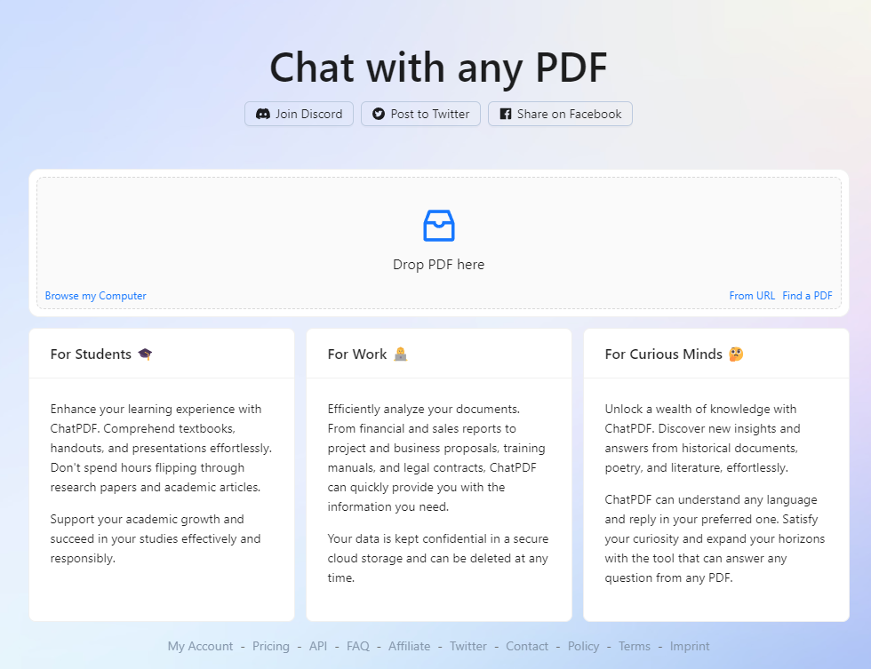
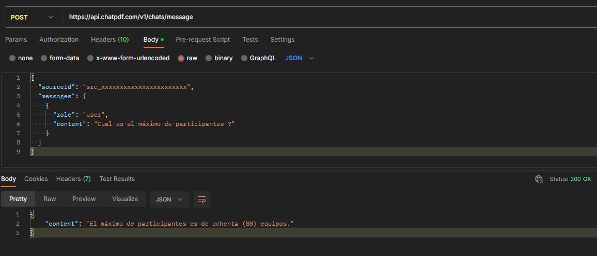
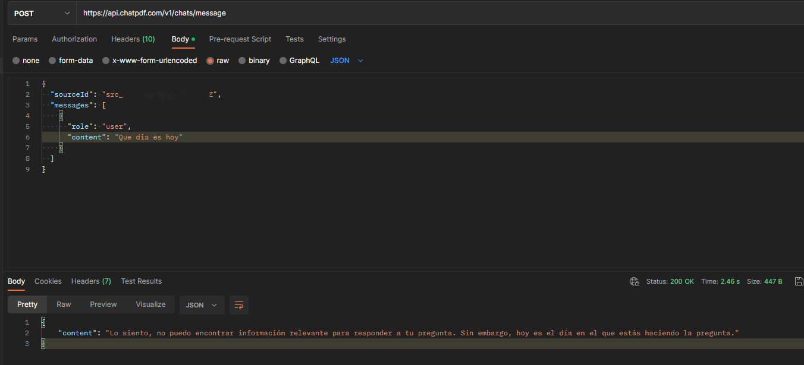

# ChatPDFExperiment
 :robot: Probando la IA ChatPDF usando una Minimal Api + Net7
## Descripcion
ChatPDF posee una IA integrada que te permite analizar archivos PDF eficientemente, Alimentandose de los datos en ellos, podrás realizar consultas como cualquier ChatBot.
[Pagina Oficial www.chatpdf.com](https://www.chatpdf.com/)

Para probar la minimalApi utilice el servicio de Postman. Adentro se encuentra dos Api's: 
- obtenerPDFKey: Obtiene la Key para el PDF cargado, el cual será un enlace directo donde se encuentra el PDF. 
- mensajePDF: Junto con la key del Pdf, este será el Chat directo con el contenido cargado.
## Respuestas
En el ejemplo, se utilizó un archivo que indica el reglamento para un torneo de Free fire 🎮:: 

Además, sin necesidad de indicarle alguna configuracion, la IA es capáz de responder de manera agradable al público cuando no puede responder una pregunta que no esté en el contenido cargado (PDF). 

### Autor
- Alejandro jimenez.
